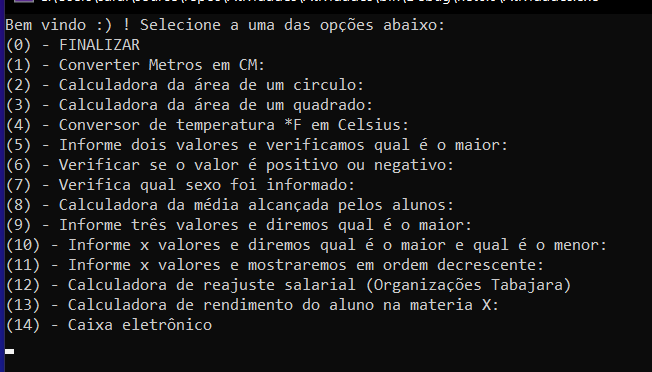

# exercicos-logica

Este projeto foi iniciado com [C#]

### Você pode executar o sistema com:

         dotnet run

 `Processo de criação do projeto:`

- [x] Criação das funcionalidades com C#;

`Para utilizar o Menu, basta selecionar uma das opções!`
`funcionalidades:`

- [x] Converter Metros em CM;
- [x] Calculadora da área de um circulo;
- [x] Calculadora da área de um quadrado;
- [x] Conversor de temperatura *F em Celsius;
- [x] Informe dois valores e verificamos qual é o maior;
- [x] Verificar se o valor é positivo ou negativo;
- [x] Verifica qual sexo foi informado;
- [x] Calcular a média alcançada pelos alunos;
- [x] Informe três valores e diremos qual é o maior;
- [x] Informe x valores e diremos qual é o maior e qual é o menor;
- [x] Informe três valores mostraremos em ordem decrescente
- [x] Calculadora de reajuste Salarial (Organizações Tabajara);
- [x] Calculadora de rendimento do aluno na materia X;
- [x] Caixa eletrônico;

## 🤝 Colaboradores

<table>
  <tr>
    <td align="center">
      <a href="#">
         
        
          <b>Isabelle Galvão</b>
        
      </a>
    </td>
  </tr>
</table>
